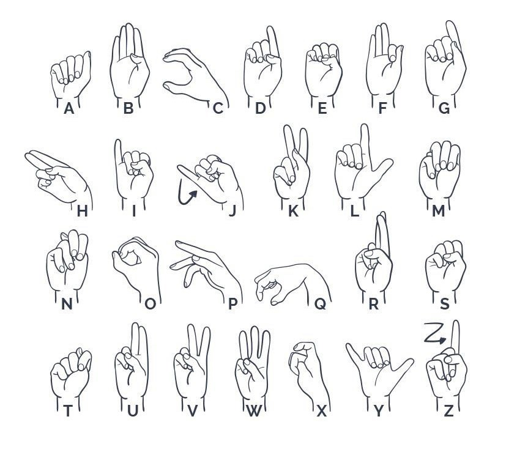
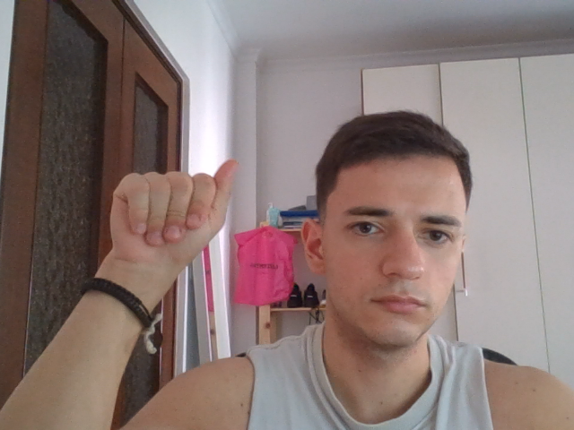
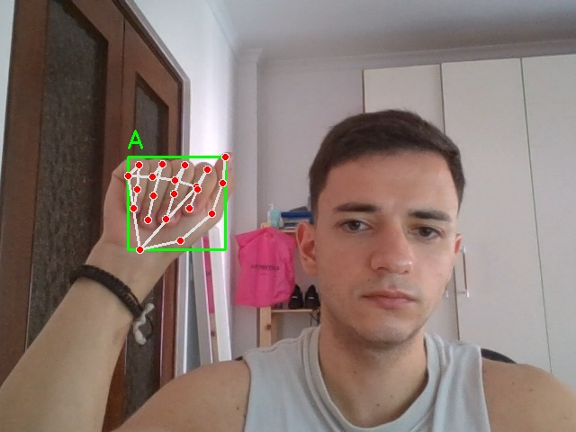
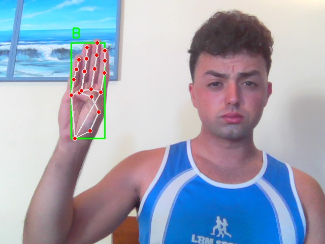
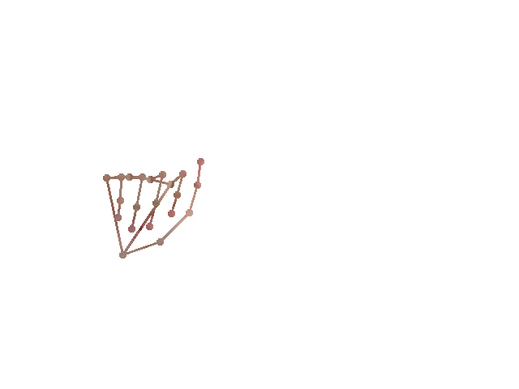
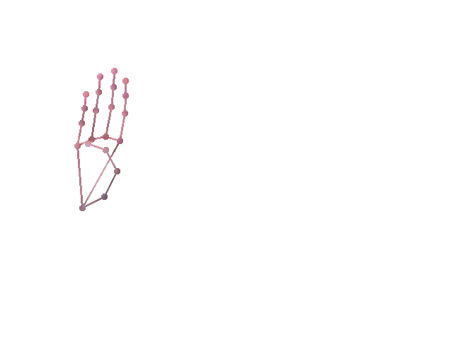

# ASL Hand Gesture Detection
This repository contains code for creating a dataset for ASL hand gesture detection, training a deep learning model, and testing the trained model. The datasets used and pre-trained models are available for download at the provided links.

## Abstract

Hand gesture detection is a pivotal task in the realm of human-computer interaction, particularly in recognizing the letters of the American Sign Language (ASL) alphabet from hand movements. By accurately interpreting these gestures, it becomes possible to bridge communication gaps for individuals who rely on sign language. The codes in this repository demonstrate how different models vary in their suitability for addressing this task, providing insights into the strengths and limitations of each approach. By leveraging advanced algorithms and deep learning models, we aim to develop a robust system capable of identifying ASL gestures in real-time, thereby facilitating improved learning and communication for both learners and users of sign language.

## Dataset
In this repository, we used a single dataset that we created ourselves, the dataset can be downloaded from this [link](https://drive.google.com/file/d/1r4m1WskXLogArQd5eSvwegI3OLVMtHKJ/view?usp=drive_link). This dataset contains 29 folders, each representing a letter of the alphabet from A to Z, plus 3 additional folders for SPACE, DELETE, and NOTHING.
### How to make dataset
As previously mentioned, this repository provides the code to create a dataset with personal photos. The first step is to create a main folder in your environment, and inside the main folder, you must create 29 subfolders named from A to Z (American alphabet), plus NOTHING, DELETE, and SPACE. Once the folders are created, you can run the first script [```camera_acquisition.py```](make_dataset/camera_acquisition.py), it is important to change the path ``` save_dir ```. The acquisition of frames starts after pressing the space key and waiting for 3 seconds. To stop the acquisition, press 'q'. To ensure the folders have the same number of images, you can use the script  [```elimination_image.py```](make_dataset/elimination_image.py)remember to change the path of the  ```save_dir```. The resulting images will look like this:: 
<div style="display: flex; justify-content: space-between;">
  
  
</div>

Afterward, we can apply two types of preprocessing to the images. If we use the script [```detect_only_landmarks.py```](make_dataset/detect_only_landmarks.py), the output images will contain only the landmarks and bounding boxes (it is important to change the paths of ```input_dir``` and ```output_base_dir```). The result will be:
<div style="display: flex; justify-content: space-between;">
  
  
</div>

If we use the in [```landmarks_and_remove_background.py```](make_dataset/landmarks_and_remove_background.py) (change path ```main_folder``` and ```output_folder```), in this case the result will be: 
<div style="display: flex; justify-content: space-between;">
  
  
</div>

If we use the in [```graph_net/dataset_numpy_graph_net.py```](graph_net/dataset_numpy_graph_net.py) (change path ```main_folder```), in this case the result will be an a main folder ```named npy_dataset``` and 29 subfolder named from A to Z plus SPACE and inside each subfolders there are numpy files with position

## Model
To solve this task, we tried two approaches. The first approach involved training models to recognize finger positions through images, and the second method involved training a network to recognize letters through the x, y, z coordinates of hand landmarks.

1. **First Method**
   As previously mentioned, in this case, the networks were trained on actual images. To do this, we used our dataset with preprocessing performed using the file [```landmarks_and_remove_background.py```](make_dataset/landmarks_and_remove_background.py) to reduce the problems of lighting and cluttered background. The results obtained are as follows:

   | Model         | epochs | accuracy |
   |---------------|--------|----------|
   | CNN           |    5   |  0.992   |
   | AlexNet       |    5   |  0.227   |
   | SwimTransform |    5   |  0.5446  |
   | VGG16         |    5   |  0.997   |

   After training, the models were tested using the files [```test_model_frames.py```](test_model/test_model_frames.py) and [```video_VGG16.py```](make_dataset/test_model/camera_test_video_VGG16.py). The first file tests the model with images that are not present in the dataset for training, testing, or validation, while the second file performs a real-time test with the computer's video camera.

2. **Second Method**
   In this case, the network was trained with our dataset created with the file [```dataset_numpy_graph_net.py```](graph_net/dataset_numpy_graph_net.py). The difference from the first method is that the network was trained using the positions of the fingers of the hands. The trained model can be tested using the file [```test_video_camera_graphNet.py```](graph_net/test_video_camera_graphNet.py).
   | Model         | epochs | accuracy |
   |---------------|--------|----------|
   | GraphNet      |    5   |  0.965   |


